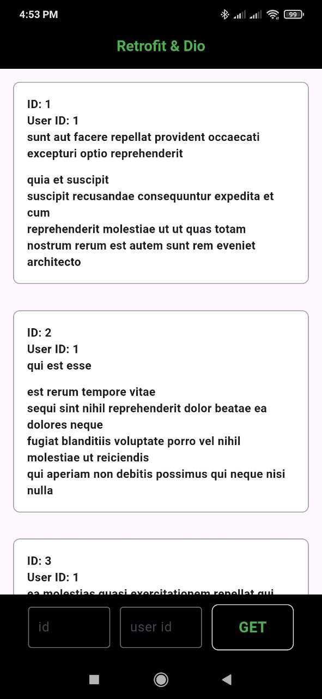

## retrofit & dio

FLUTTER | DART

I did it while I was learning how to work with dio and retrofit.

Implemented HTTP requests (GET, POST, PUT, DELETE) to api of jsonplaceholder (https://jsonplaceholder.typicode.com) using REST API.

